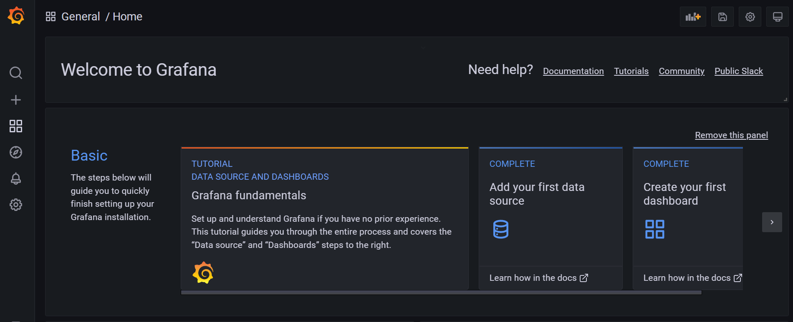
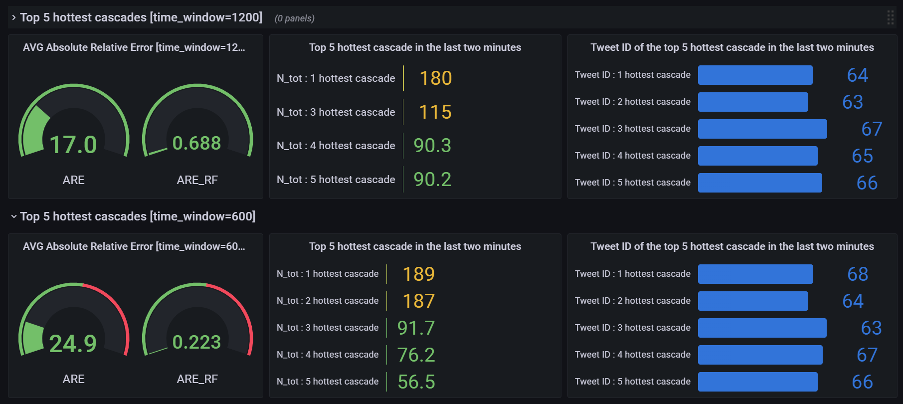
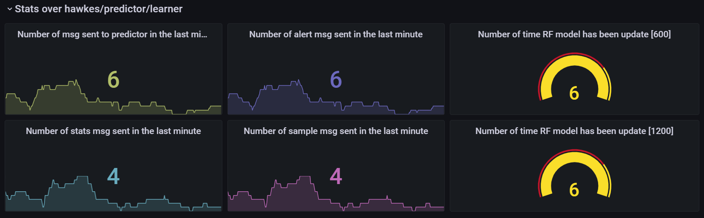
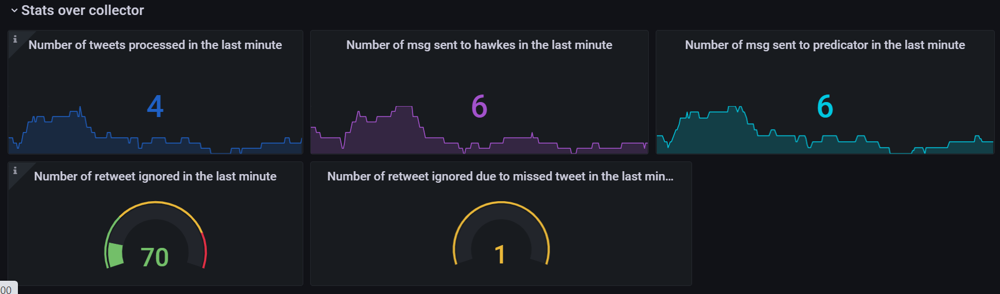
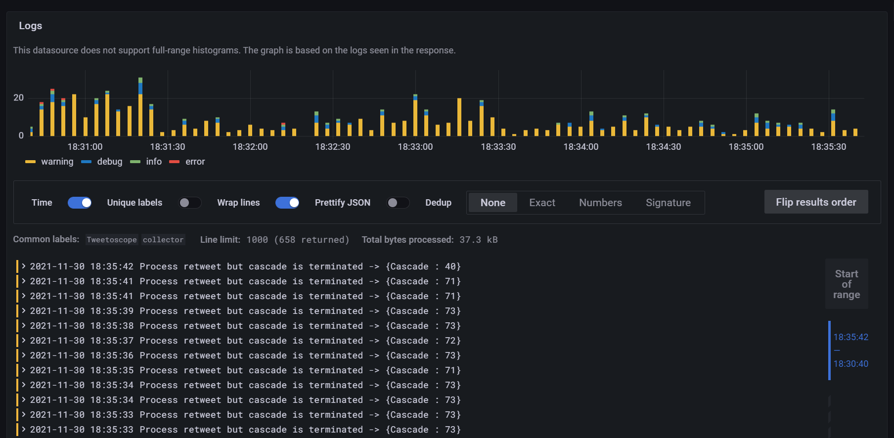

# Dashboard
--- 
## Presentation
The visualization of the dashboard is done with Grafana. Loki and Prometheus are used as sources to send information to Grafana. The Python scripts allow to connect to the Python API of Loki and Prometheus in order to send the data you want to visualize. These scripts consume messages from different Kafka topics and send them to Grafana.

## Through the grafana dashboard
1. Whether via docker compose or via kubernetes minikube, access to the dashboard is done at the following address: `localhost:3000`.  

 

2. If we go to the Manage tab of the Dashboard menu, we find our dashboard in `Services/Tweetoscope`.

3. You will now have access to our dashboard which has several sections with several graphs. 
   1. The first two lines contain information about the performance of the prediction as a function of the time windows (here 600 and 1200).  
They also contain information about the hottest tweets with their ids.

3. 
   2. Then we have information about the learner, the predictor and the hawkes-estimator. We have globally the number of messages sent by each microservice in the last minute as well as the number of times a RamdomForest has been updated. 

3. 
   3. Last we have information about the collector, the number of messages sent in the last minute ...
The last two pie charts give interesting information for deployment and adjustment of certain parameters.  One gives the number of retweets ignored because the cascade is considered finished (useful to size the time to consider a cascade finished) and the other gives the number of retweets ignored because the main tweet has not been processed (this can happen at the beginning if the generator is launched before the collector)

4. Finally, if you go to the `Explore` menu, it is possible to view the same logs that the microservice logger offers.  
To get all logs published by the collector: `{service="collector"}`

